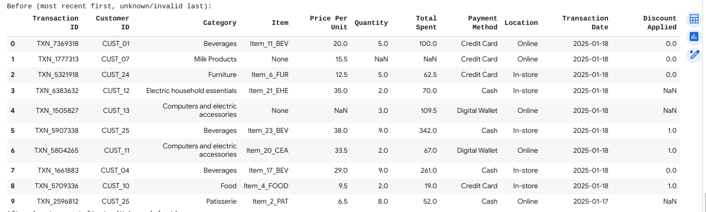
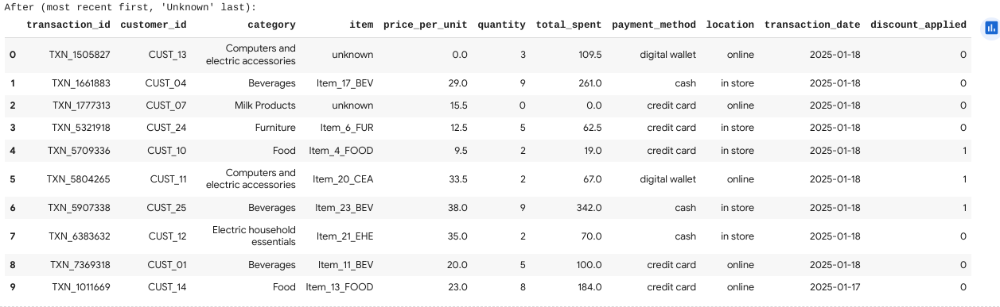

# 🛠️ Retail Sales Data Cleaning with SQL

This project demonstrates how to clean and standardize a **messy retail sales dataset** using **SQLite + SQL queries** inside a **Google Colab workflow**.  

---

## 📂 Dataset
- **Source**: Kaggle Dirty Retail Sales CSV  
- **Rows**: 12,575 raw transactions  
- **Issues identified**:
  - Null values in multiple columns  
  - Inconsistent date formats  
  - Misaligned total calculations (`total_spent ≠ price_per_unit × quantity`)  
  - Mixed casing & inconsistent naming  

---

## 🔹 Cleaning Steps
1. **Load & Stage Data**  
   - Imported raw CSV into SQLite (`raw_data`).  
   - Created staging tables for cleaning.

2. **Remove Duplicates**  
   - Verified uniqueness by `Transaction ID`.  
   - Result: **0 duplicates removed** (each transaction was unique).

3. **Handle Null Values**  
   - Standardized `NaN` → `NULL`.  
   - Replaced missing `Transaction Date` with **“Unknown”** for clarity.  
   - Nulls in numeric fields were converted to `0` where appropriate.

4. **Validate Numeric Columns**  
   - Checked whether `total_spent ≈ price_per_unit × quantity`.  
   - Flagged **609 mismatched rows** for potential review.

5. **Standardize Formats**  
   - Lowercased text-based columns (e.g., `payment_method`, `location`).  
   - Normalized date format as `YYYY-MM-DD`.  

6. **Sort by Recency**  
   - Final dataset sorted by **most recent → oldest**, with **Unknown** dates placed at the end.  

---

## 📊 KPIs
| KPI | Value |
|-----|-------|
| Rows (raw) | 12,575 |
| Rows (final) | 12,575 |
| Duplicates removed | 0 |
| Null values (raw) | 7,229 |
| Null values (final) | 0 |
| Bad dates (raw) | 0 |
| Bad dates (final) | 0 (Unknown kept for clarity) |
| Real dates (final) | 12,575 |
| Total mismatches flagged | 609 |

---

## 📸 Before & After Snapshots
### **Before (raw, inconsistent)**  
- Transactions had missing values, mixed casing, and misaligned totals.  
- Dates not ordered consistently.

### **After (cleaned, standardized)**  
- All fields aligned and standardized.  
- Dates sorted **most recent → oldest**.  
- Missing dates marked as **Unknown**.

---

## 📦 Deliverables
- 📂 `DirtyRetailSales.csv` → raw dataset  
- 📂 `DirtyRetailSales_cleaned.csv` → final cleaned dataset  
- 📜 SQL queries (Colab notebook) showing each cleaning step  
- 📊 Before/after table snapshots & KPI summary  

---

## 🚀 Key Takeaways
- Even **messy CSVs** can be cleaned systematically using **SQL transformations**.  
- KPIs provide transparency into exactly what was changed.  
- This pipeline is **reusable** for similar datasets in retail, e-commerce, or financial transactions.  

---

# ✅ Next Steps
- Automate this cleaning process in an **ETL pipeline** (Python + SQL).  
- Extend validation logic to include **outlier detection** and **discount verification**.  
